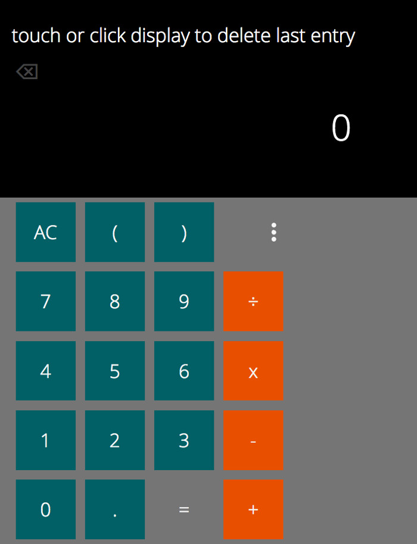

#Calculator App v2

The calculater has its own [gihub page](https://appijumbo.github.io/calculatorAppv1/)

This is also at CodePen.io http://codepen.io/tom_o/pen/LGoYyW.

##About Version 2: 
This version uses the jquery 'on' eventListener to bind to the keyPress, rather than the 'o'clock' buried in the HTML. An anonymous function was used to pass the keypress parameters (row, col) to the KeyPress function

I perhaps should have used event handling techniques to reduce the number of event listeners and rely on the 'bubbling up' of events. I'll look into this next time.

##Info:
This calculator was was created for the Free Code Camp course. It uses the mathsJS library so that it can be upgraded easily in future. I decided to include brackets i.e. ( ) in the basic keyboard layout. After years of teaching maths it is clear that many people get confused over the operator priority aka BODMAS (brackets, order, division, multiplication, addition, subtraction) and so this helps a little. I intended to inclue a bodmas parser to aoutomaticaly put brackets around numbers to re-enforce this, but because of time constraints I've had to put this to one side.